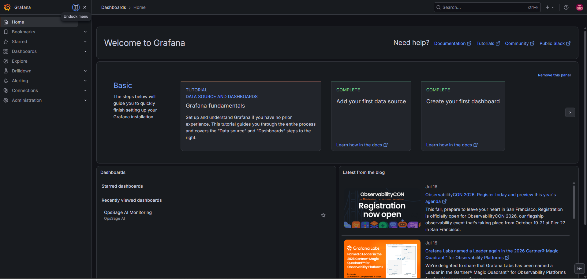
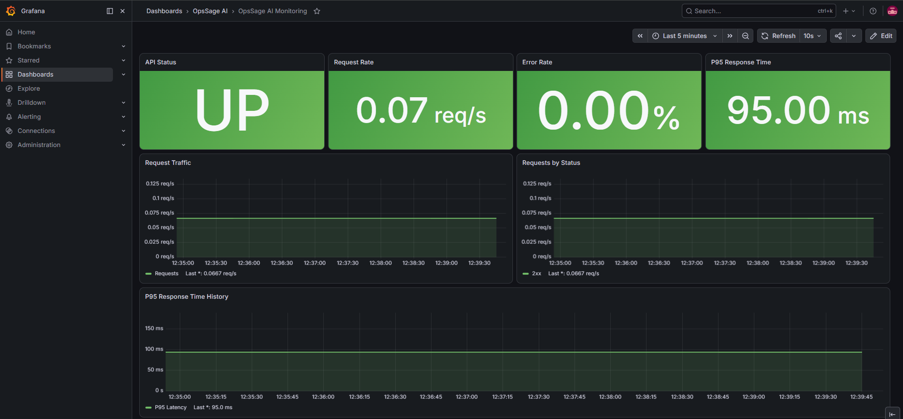
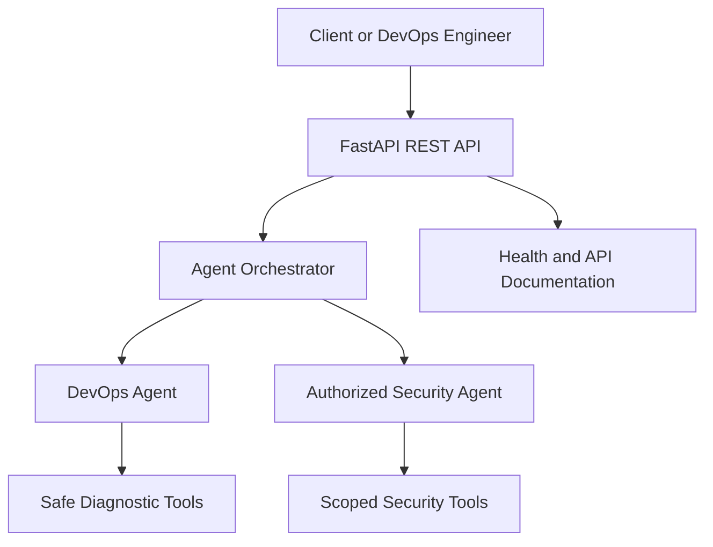

# OpsSage AI

[](https://github.com/amitp98414/opssage-ai/actions)


A containerized, multi-agent AI backend for DevOps diagnostics and authorized security assistance. Built with FastAPI, Docker, automated tests, GitHub Actions and CircleCI.

> Portfolio case study demonstrating backend development, containerization, automated testing and CI/CD engineering.

## Live Demo

- [Public API](https://opssage-ai.onrender.com/)
- [Interactive Swagger Documentation](https://opssage-ai.onrender.com/docs)
- [Health Check](https://opssage-ai.onrender.com/health)

> The public portfolio deployment uses a disabled AI key for safety. AI agent execution is available in an authenticated deployment.

## Project Showcase

### Grafana Dashboard Overview



### OpsSage AI Monitoring



## What It Solves

DevOps teams often waste time collecting logs, checking infrastructure and selecting the correct troubleshooting workflow. OpsSage AI provides one API that routes requests to specialized agents for:

- DevOps diagnostics
- Docker and Linux troubleshooting
- Git and CI/CD guidance
- Authorized security analysis
- Automatic specialist selection

## Core Features

- Multi-agent orchestration with `auto`, `devops` and `bugbounty` modes
- FastAPI REST backend with interactive Swagger documentation
- Docker and Docker Compose support
- Health-check endpoint for monitoring
- Automated API tests with Pytest
- Test coverage reporting
- GitHub Actions CI pipeline
- CircleCI test pipeline
- Environment-based secret management
- Safety controls for authorized security workflows

## Architecture



## API Endpoints

| Method | Endpoint | Purpose |
|---|---|---|
| GET | `/` | Application information |
| GET | `/health` | Service health status |
| GET | `/agent/modes` | Available agent modes |
| POST | `/agent/run` | Run the selected AI agent |
| POST | `/chat` | Send a general AI request |
| GET | `/docs` | Interactive Swagger documentation |

## Technology Stack

- Python
- FastAPI
- Pydantic Settings
- OpenAI API
- Docker
- Docker Compose
- Pytest and Pytest Coverage
- GitHub Actions
- CircleCI

## Quick Start

### 1. Clone the repository

```bash
git clone https://github.com/amitp98414/opssage-ai.git
cd opssage-ai
```

### 2. Configure environment variables

```bash
cp backend/.env.example backend/.env
```

Open `backend/.env` and provide your own API key:

```env
OPENAI_API_KEY=your_openai_api_key_here
OPENAI_MODEL=gpt-4.1-mini
```

Never commit the real `.env` file or API key.

### 3. Start with Docker

```bash
docker compose up --build -d
```

### 4. Verify the service

```bash
curl http://localhost:8000/health
```

Open the API documentation:

```text
http://localhost:8000/docs
```

### 5. Stop the application

```bash
docker compose down
```

## Automated Testing

```bash
source backend/.venv/bin/activate
cd backend
python -m pytest -v --cov=app --cov-report=term-missing
```

The API test suite validates:

- Root endpoint
- Health endpoint
- Agent modes endpoint

## CI/CD

Every pull request is automatically tested through:

- GitHub Actions
- CircleCI

Both pipelines install dependencies, run the backend tests and generate coverage results before code is merged.

## Project Structure

```text
.
├── .circleci/
├── .github/workflows/
├── backend/
│   ├── app/
│   │   ├── agents/
│   │   ├── api/
│   │   ├── core/
│   │   ├── services/
│   │   └── tools/
│   ├── tests/
│   ├── Dockerfile
│   └── requirements.txt
├── scripts/
├── docker-compose.yml
└── README.md
```

## Security

This project supports defensive and authorized security work only. Run security-related operations exclusively on systems you own or have explicit permission to test.

Secrets are loaded through environment variables and excluded from Git tracking.

## Roadmap

- Prometheus and Grafana monitoring
- Nginx reverse proxy
- PostgreSQL persistence
- Redis task queue and caching
- Cloud deployment
- Centralized logging
- Container security scanning

## Professional Services Demonstrated

This project demonstrates the ability to:

- Dockerize Python applications
- Build and test FastAPI services
- Create GitHub Actions and CircleCI pipelines
- Implement health checks
- Troubleshoot failed CI jobs
- Protect API keys and rewrite unsafe Git history
- Manage feature branches and pull requests

## Author

**Amit Patil**  
DevOps Engineer focused on Docker, Linux, CI/CD automation and cloud deployment.

## License

Licensed under the MIT License.
## Observability Stack

The project includes a production-style monitoring stack powered by Prometheus and Grafana.

| Service | URL | Purpose |
|---|---|---|
| Backend API | http://localhost:8000 | FastAPI application |
| API Documentation | http://localhost:8000/docs | Interactive Swagger documentation |
| Prometheus | http://localhost:9091 | Metrics and alert rules |
| Grafana | http://localhost:3000 | Monitoring dashboards |

### Start the stack

Create the local environment file and replace the example password:

```bash
cp .env.example .env
docker compose up -d
```

### Monitoring features

- FastAPI Prometheus metrics at `/metrics`
- Provisioned Prometheus data source
- Version-controlled Grafana dashboard
- API availability monitoring
- Request-rate and HTTP-status graphs
- Error-rate monitoring
- P95 response-time monitoring
- API-down, high-error-rate and high-latency alerts

The dashboard is available under:

```text
Dashboards → OpsSage AI → OpsSage AI Monitoring
```
